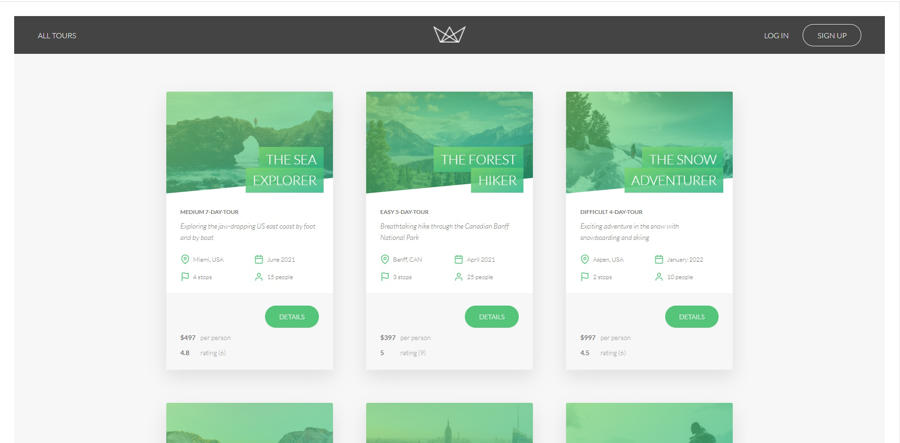
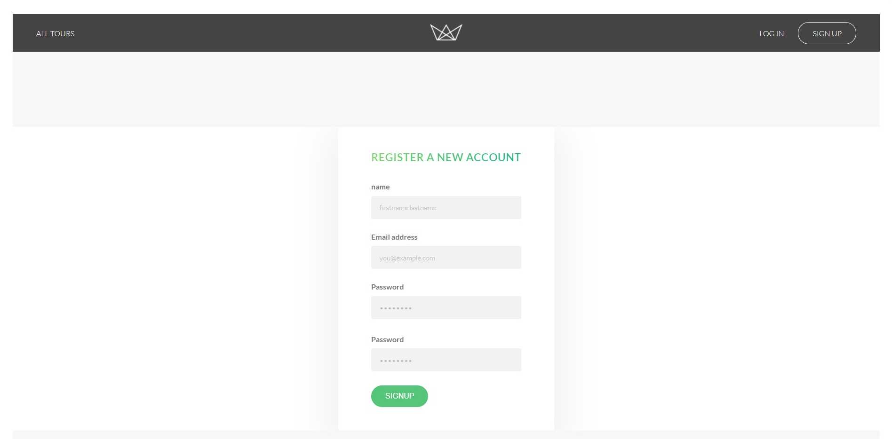
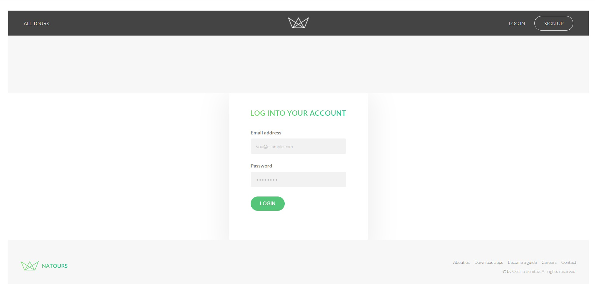

# Natours API

Natours is a fictional company that sell tours and life experiences for travelers
and adventurers, this API has a very complete authentication sistem, with the ability of
resetting passwords and send emails to users, also has 3 models one for users, one for tours and one for reviews, you can upload pictures for the users and for the tours, but in the case of the tours only from the API.
  
 

 

 

## Built With
- JavaScript
- Node.Js

## Author
### Cecilia Benitez
- 👤 [GitHub](https://github.com/Ceci007)

## Show your support
Give a ⭐️ if you like this project

## Acknowledgments
- Inspiration
Appreciate Jonas Schmedtmann course on Udemy.